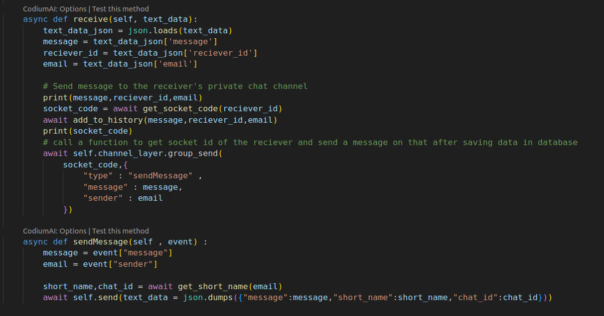

# Setup

## Virtual Environment


To ensure a clean and organized development environment, it is highly recommended to use a virtual environment when working with any project. You can create a virtual environment for your project by running the following command in your terminal:

```bash
python -m venv <name of virtual environment>
```

Once your virtual environment is created, you can activate it using the appropriate command for your operating system.

Windows:
```bash
.\<name of virtual environment>\Scripts\activate
```

Linux/Unix:
```bash
source <name of virtual environment>/bin/activate
```

By activating your virtual environment, you can ensure that any dependencies and packages you install will be isolated from your global environment, making it easier to manage and maintain your project.

## Installing Dependencies


      
To install all the necessary dependencies for your project, simply run the following command in your terminal:

```bash
pip install -r requirements.txt
```
This command will read the requirements.txt file and automatically install all the listed dependencies for you. Make sure your virtual environment is activated before running this command to ensure that the packages are installed in the correct environment. Once the installation is complete, you'll be ready to start working on your project!

## .env

<b> Important Note: </b>
Please make your own .env from demo.env file and add your own credentials.

## Running the app

To run the app you need to run the following commands in your terminal:

```bash
python manage.py makemigrations
python manage.py migrate
python manage.py runserver
```


# About the project:

## Frontend

### Signup

When you first open the code you might need to signup. No worries as OTP will be sent to your email for verification and you can use that OTP to signup.


### OTP

Here you enter OTP that yoou have recieved on your email.


### Login

After you have successfully signed up you can login using your email and password.


### Chat Page

This is the page you will see after you first login. It will be blank as you have not added any friends yet.


### New Chat

Here you can chat with new friends using their email id. If email is not present an error will be shown.


New User Added to the chatList on the left


You will also be shown on the other user's chatList


### Chatting with friends

Now we press on the friend we want to chat with and we can start chatting with them. For now chat history is empty as no messages have been sent.


### User Online

If user is online you will see their name in green color


### Sending Message

When you send a message it will be shown on your screen and saved in the database for future use.


If user has not opened your chat is talking to someone else they will be alerted with a notification of a new message by a blue dot in front of your name in their chatList


Once they open your chat the blue dot will disappear and they will be able to see your message. Chat will be updated in real time as it is using sockets.


All chats will be saved even if page is reloaded chat history will be shown whenever you open the chat again

## Backend

In backend there are 3 main files doing all the magin
1. Views.py - Handles all REST API requests
2. Chat.js - Handles all frontend requests including socket on frontend
3. Consumers.py - Handles all Socket connections

### Views.py - User functions

Handles all login, signup, otp, autologin, logout functions for the user


### Views.py - Chat functions

Handles all chat related functions like: 
1. Getting Chat List


2. Adding new chat


3. Getting Chat History


### Chat.js - Base URL

Before Running the app you need to change the base url in chat.js file to your own localhost url for now I am running this on port 8000 therefore it is set to http://127.0.0.1:8000


### Chat.js - REST API to get all user connections

In this we get all the users that are connected to the current user if no user is connected then it will return an empty list


### Chat.js - REST API to start new chat

In this we start a new chat with a user using their email id. If email id is not present in the database then it will return an error. 


### Chat.js - REST API to start new chat

In this we get all the chat history of the user with the friend. If no chat history is present then it will return an empty list.


### Chat.js - Socket Connection Initiation

In this we initiate a socket connection with the backend. We send email of the user to the backend so that it can be used to identify the user.


### Chat.js - Socket Send Message

In this we send a message to the backend using the socket connection. We send the message, email of the user and id of the friend to the backend so that it can be used to identify the user and friend.


### Chat.js - Socket Message Received

In this we receive a message from the backend using the socket connection. In case User 2 has not opened the chat with User 1 then User 1 will be alerted with a blue dot in front of User 2's name in the chatList. If User 2 has opened the chat then the message will be shown on the screen and chat history will be updated.


### Consumers.py - Socket Connection Initiation

Here we initiate a socket connection with the frontend. We get the email of the user from the frontend so that it can be used to identify the user.
A unique socket id is also generated for the user so that we can identify whom to forward the message to. Also a sync_to_async decorator function is used to access the Database from Models.py in order to prevent blocking of the main thread.


### Consumers.py - Socket Message Transfer

Here we receive a message from the frontend using the socket connection. We get the message, email of the user and id of the friend from the frontend so that it can be used to identify the user and friend. We then send the message to the friend using their socket id.




# Video Demo

Here is a video demo of the project: 
[](Readme_images/video.webm)

